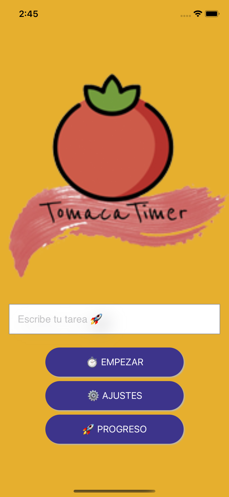
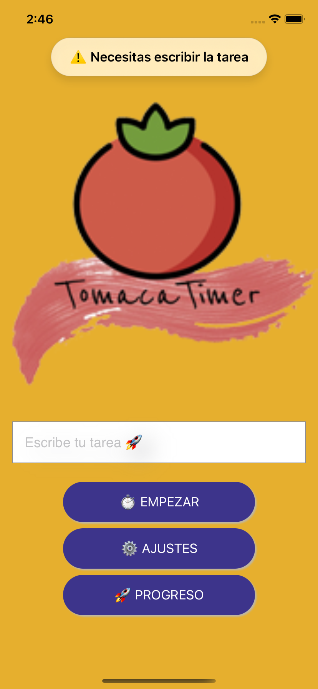
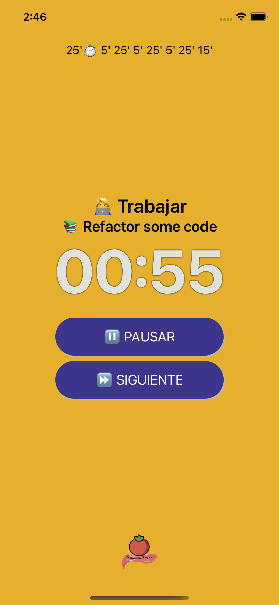
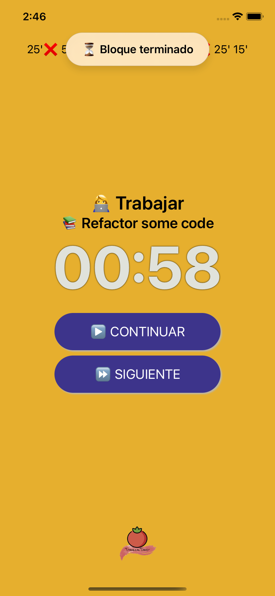
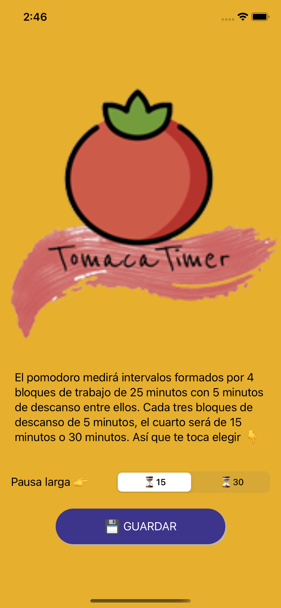
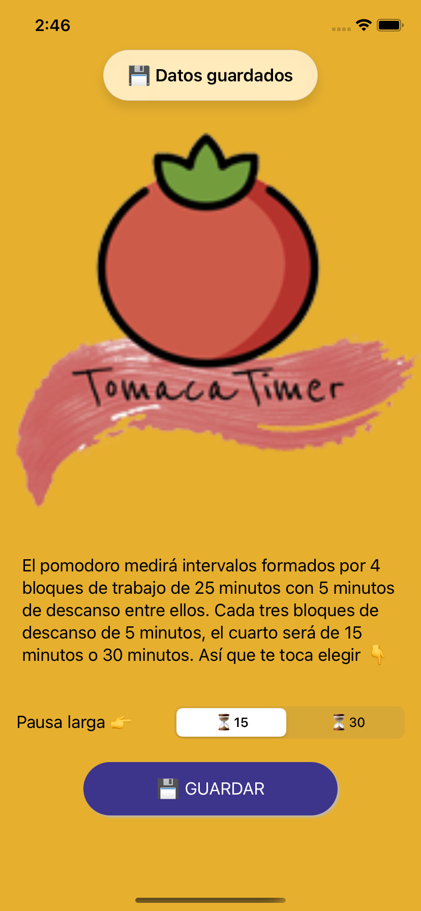

# TomacaTimer

**POMODORO**: Crea un "Pomodoro" configurable que guarde todo tu historial de tareas by [Muredev](https://github.com/mouredev/) 

La información de los retos por aquí 👇

[Monthly App Challenge 2022](https://github.com/mouredev/Monthly-App-Challenge-2022)

### 📸  Capturas de pantalla
<table>
<tr><td colspan="2"></td></tr>
<tr><td colspan="2">Inicio</td></tr>
<tr>
<td></td>
<td></td>
</tr>
<tr><td colspan="2">Contador</td></tr>
<tr>
<td></td>
<td></td>
</tr>
<tr><td colspan="2">Ajustes</td></tr>
<tr>
<td></td>
<td></td>
</tr>
</table>
